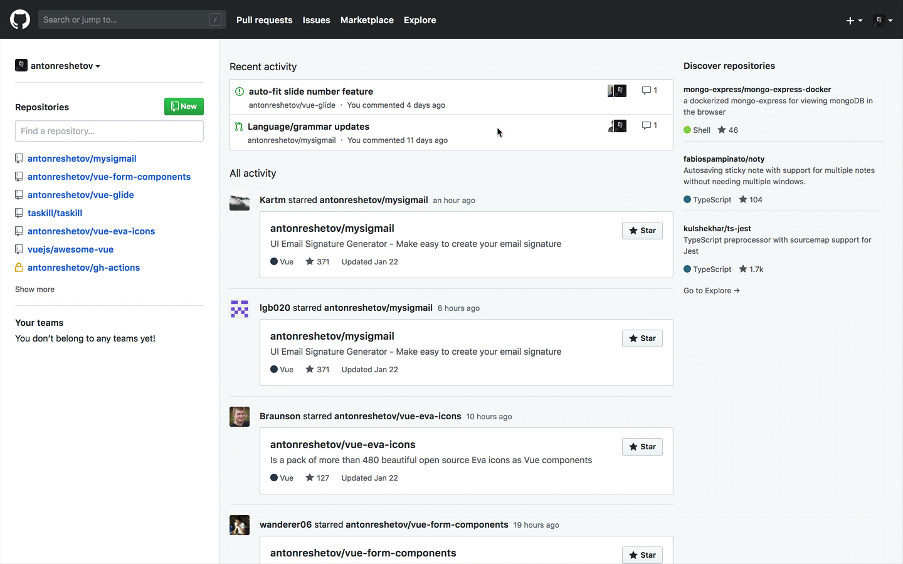

# 980 Github Dashboard

> Make GitHub Dashboard Great Again

If you do not like the new GitHub dashboard (like me), maybe this is what you need.

This is a small extension for Chrome.

## Install

Download this repo and install extension in Chrome

1. Go to chrome://extensions/ and check the box for Developer mode in the top right.
2. Click the Load unpacked extension button and select folder of this repo.